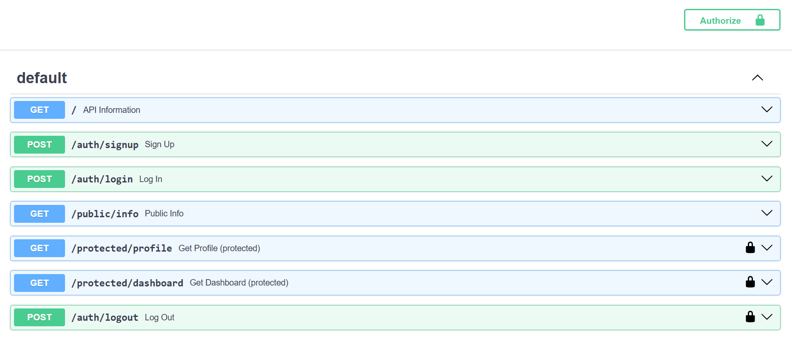

# Auth API - FastAPI + Supabase Authentication

A secure REST API built with **FastAPI** that handles user signup, login,
and logout using **Supabase Auth**, and protects specific routes with
JWT bearer token verification.

## What this project is

Previous assignments built an open API anyone could read or write to.
This one adds real authentication: users sign up and log in through
Supabase (an external Identity Provider), receive a JWT access token,
and must present that token to access protected routes. The server
verifies every protected request against Supabase before responding.

## How authentication works here

1. Client sends email + password to `/auth/signup` or `/auth/login`.
2. Supabase validates the credentials and returns a JWT access token.
3. Client sends that token on future requests in the header:
   `Authorization: Bearer <token>`
4. A reusable FastAPI dependency (`get_verified_token`) extracts the
   token from the header and asks Supabase to verify it before the
   route's own code ever runs. Invalid, missing, or expired tokens are
   rejected with `401` before reaching the route.

## Technologies Used

Python 3 · FastAPI · Uvicorn · Supabase Auth · python-dotenv

## Setting up your own environment

**1. Create a free Supabase project** at supabase.com, and under
Project Settings -> API Keys, copy your Project URL and publishable
key.

**2. Create a `.env` file** in the project root (see `.env.example`
for the shape):

```
SUPABASE_URL=your_project_url
SUPABASE_KEY=your_publishable_key
PORT=8000
```

**3. In your Supabase project**, go to Authentication -> Sign In /
Providers -> Email, and turn OFF "Confirm email" for easy local
testing (otherwise new signups can't log in until they click a
confirmation email link, and Supabase's free tier rate-limits how many
of those it will send).

## Running it

```bash
git clone https://github.com/kelashkumar-iba/auth-api-fastapi.git
cd auth-api-fastapi
python -m venv .venv
.venv\Scripts\Activate.ps1        # Windows PowerShell
pip install -r requirements.txt
python -m uvicorn main:app --reload
```

Checkpoint: the terminal should print `Server running and connected to
Supabase` on startup, with no errors.

API: http://127.0.0.1:8000
Swagger UI: http://127.0.0.1:8000/docs

## API Reference

| Method | Endpoint | Auth required? | Description |
|--------|----------|-----------------|--------------|
| GET | `/` | No | API info |
| POST | `/auth/signup` | No | Create a new account (`email`, `password` in body) |
| POST | `/auth/login` | No | Log in, returns `access_token` and `refresh_token` |
| GET | `/public/info` | No | Public, unprotected data |
| GET | `/protected/profile` | Yes (Bearer token) | Returns the authenticated user's id, email, created_at |
| GET | `/protected/dashboard` | Yes (Bearer token) | A second protected route, proving the auth dependency is reusable |
| POST | `/auth/logout` | Yes (Bearer token) | Ends the session, returns `204 No Content` |

## Status codes used

- `201` -- successful signup
- `200` -- successful login or protected read
- `204` -- successful logout
- `400` -- missing email/password on signup or login
- `401` -- missing, malformed, invalid, or expired token; or wrong login credentials

## Testing protected routes in Swagger UI

1. Log in via `POST /auth/login` in `/docs` (or with curl/PowerShell)
   and copy the `access_token` from the response.
2. Click the green **Authorize** button at the top of `/docs`.
3. Paste just the raw token (no `Bearer ` prefix -- Swagger adds that
   automatically), click Authorize, then Close.
4. Any route with a lock icon can now be tested directly with "Try it
   out" -> "Execute".



## A note on logout and token lifetime

JWTs are stateless: `POST /auth/logout` invalidates the refresh token
and tells the client to discard its session, but the *access token*
itself stays cryptographically valid until it naturally expires
(about an hour), even after logout. This is standard JWT behavior,
not a bug -- revoking an access token immediately would require the
server to track every issued token, which defeats the point of a
stateless token in the first place.

## Reusable auth dependency (the "middleware")

Rather than repeating token-checking code in every protected route,
all verification logic lives in one function, `get_verified_token`,
applied as a FastAPI Dependency:

```python
@app.get("/protected/profile")
def get_profile(request: Request, token: str = Depends(get_verified_token)):
    ...
```

Adding a new protected route is as simple as adding that one
parameter -- `/protected/dashboard` was added this way, with zero
duplicated auth logic.

## Project Structure

```
auth-api-fastapi/
├── .venv/
├── .env                (gitignored)
├── .env.example
├── .gitignore
├── main.py
├── requirements.txt
├── README.md
└── swagger-auth.png
```

## Assignment

FlyRank Internship -- Backend Track
Week 4: Auth - Login & Protect (BE-03)